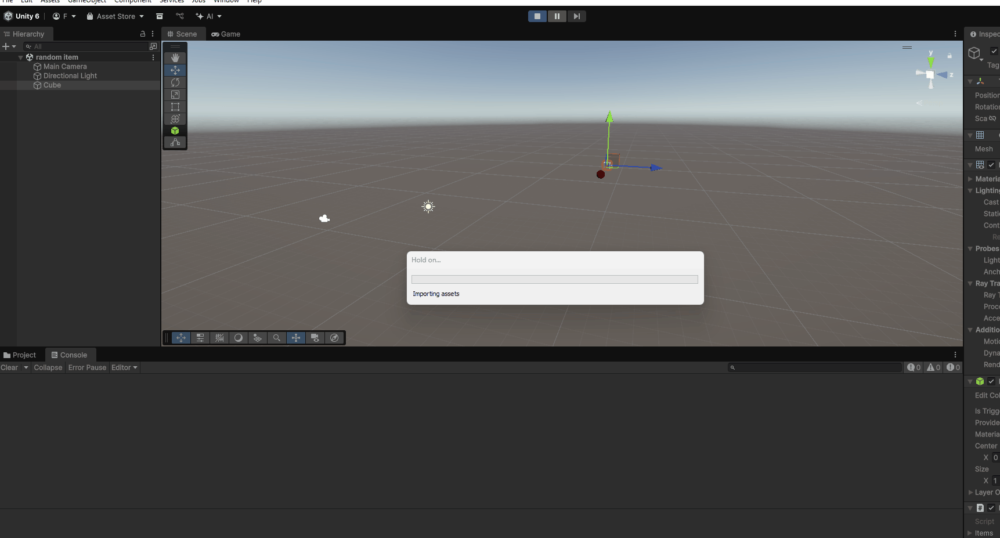

# M1 GDV — Game Development (MA)

Overzicht van opdrachten en scripts voor de Game Development module.

## Inhoud
- [Coin, Goomba en Ghost 2.1](#coin-goomba-en-ghost-21)
- [Stats 2.2](#stats-22)
- [Collisions 3.1](#collisions-31)
- [Fantasy opdracht 3.2C](#fantasy-opdracht-32c)
- [Coin pickup 4.2](#coin-pickup-42)
- [Healthbar 5.1A](#healthbar-51a)
- [WeaponSwitch 5.1B / Enum 5.1C](#weaponswitch-51b--enum-51c)
- [Health Pickup 5.2](#health-pickup-52)
- [Game 6.1](#game-61)
- [M2](#m2)
- [Random Items](#random-items)
---

## Coin, Goomba en Ghost 2.1

Beschrijving: Een coin (sphere) en objecten (cube, cylinder) laten bewegen — heen en weer bewegingen en animatie.  
Script: [coinpickup.cs](Assets/coinpickup.cs)

---

## Stats 2.2

Beschrijving: Spelerstats aangepast en uitgebreid. Toetsen: E geeft 15 damage, K herstelt 15 HP.  
Script: [playerstats.cs](Assets/playerstats.cs)

---

## Collisions 3.1

Beschrijving: Werken met colliders, Rigidbody en Physics Materials om botsingen te beheersen.

---

## Fantasy opdracht 3.2C

Beschrijving: Oefening met strings en return-waarden.  
Script: [Fantasy.cs](Assets/Fantasy.cs)

---

## Coin pickup 4.2

Beschrijving: Player pakt coin op; coin verdwijnt en geeft een debugbericht.  
Script: [coinpickup.cs](Assets/coinpickup.cs)

---

## Healthbar 5.1A

Beschrijving: Healthbar toont huidige health; reageert op schade en healing.  
Script: [healthbar.cs](Assets/Scripts/healthbar.cs)

---

## WeaponSwitch 5.1B / WeaponSwitchEnum 5.1C

Beschrijving: Wisselen tussen wapens via toetsen 1–4. Variant met enum voor betere leesbaarheid.  
Scripts: [WeaponSwitch.cs](Assets/Scripts/WeaponSwitch.cs), [WeaponEnum.cs](Assets/Scripts/WeaponEnum.cs)

---

## Health Pickup 5.2

Beschrijving: Health pickups geven life terug wanneer de speler eroverheen loopt. Vereist speler health script.  
Scripts: [HealthPickup.cs](Assets/Scripts/HealthPickup.cs), [PlayerVarHealth.cs](Assets/Scripts/PlayerVarHealth.cs)

---

## Game 6.1

Beschrijving: Mini-game waarbij alle coins verzameld moeten worden. Eindigen kan pas wanneer de speler volle health heeft. Gebruikt meerdere scripts (coin pickup, health pickup, player health).  
Scripts: [PlayerVarHealth.cs](Assets/Scripts/PlayerVarHealth.cs), [HealthPickup.cs](Assets/Scripts/HealthPickup.cs), [coinpickup.cs](Assets/coinpickup.cs)

---

# M2

---

## Random items

Beschrijving: Herhaling van datatypes en we hebben met private gewerkt en random items in de console laten appearen als je op een bepaald knop klikt. ik heb nmr1 voor een willekeurig item, en nmr 2 voor alle items
Script: [Randomitems](Assets/Scripts/randomitems.cs)

