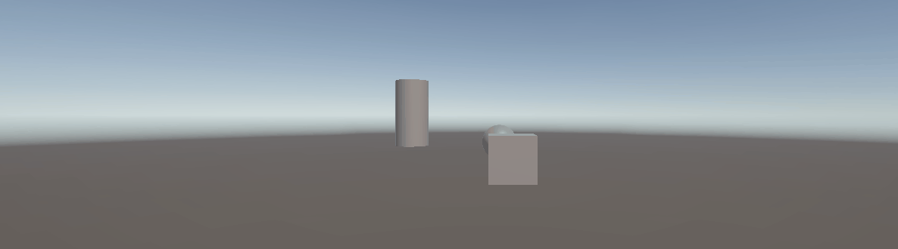
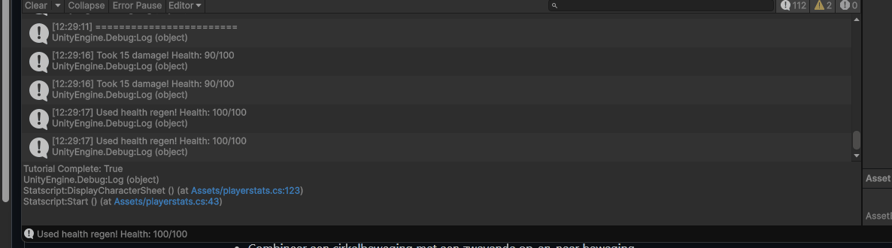
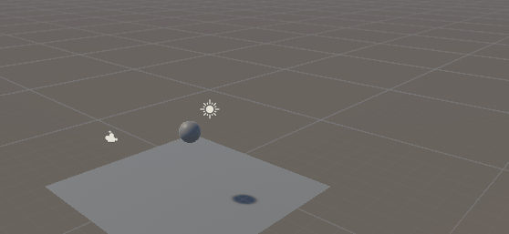
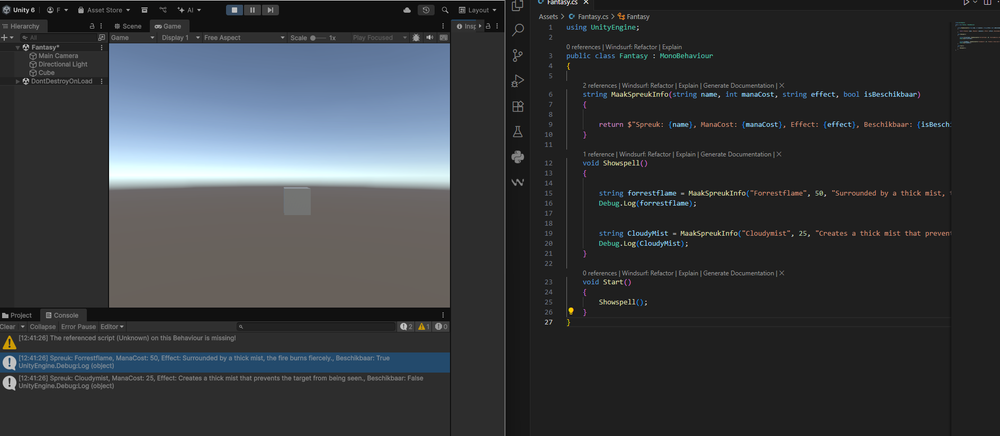
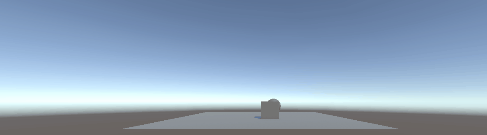
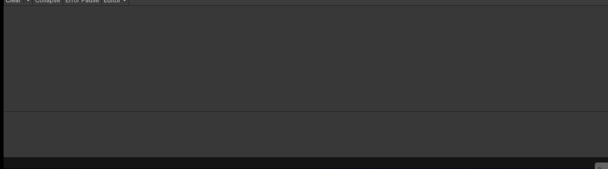
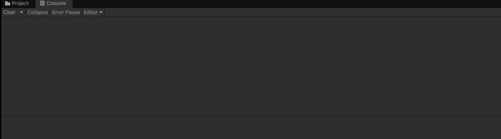
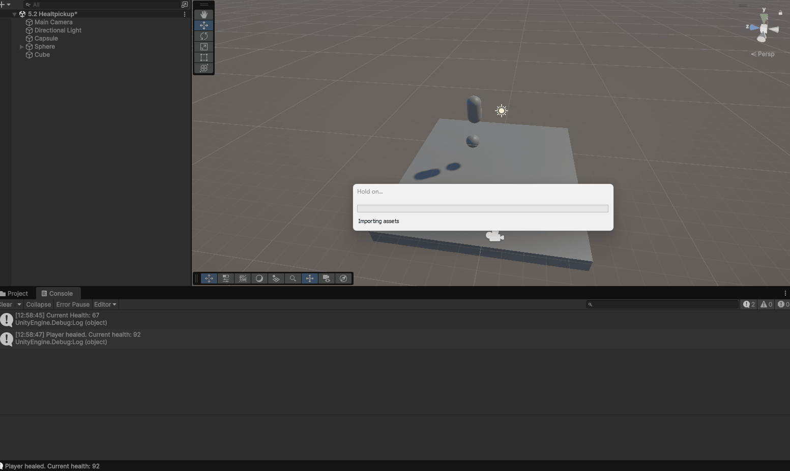
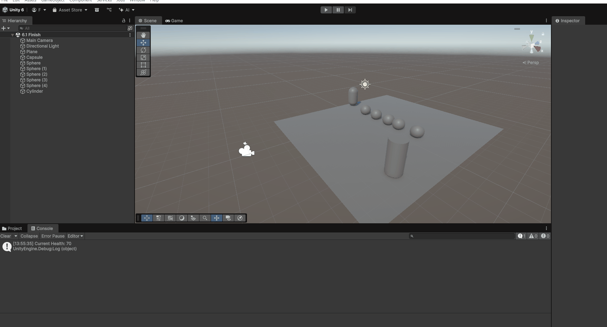

# M1GDV
Game Development Repo MA

# Coin, Goomba en Ghost 2.1

Omschrijving: Een coin laten bewegen (cube). De cirkel een heen weer laten zien(sphere) en de cylinder heen en weer laten gaan.
Script: [coin](Assets/coinpickup.cs)

# Stats 2.2

Omschrijving: Stats veranderd en toegevoegd. Keys toegevoegd: E en K. E neemt 15 damage. K healt 15HP
Script: [Stats](Assets/playerstats.cs)

# Collisions 3.1
Omschrijving: We hebben gewerkt met collisions. dus een rigidbody en physic material

# Fantasy opdracht 3.2C

Omschrijving: Gewerkt met string en return.
Script: [Fantasy](Assets/Fantasy.cs)

# Coin pickup 4.2

Omschrijving: Zodra een player (cube) de coin (sphere) oppakt gaat de coin weg en laat een debug log zien dat die is opgepakt
Scripts [coinpickup](Assets/coinpickup.cs)

# Healthbar 5.1A

Omschrijving: Een healthbar die health displayed. als damage word gepakt laat ie de nieuwe health zien en of je moet oppassen. zelfde geld met health erbij krijgen
Script: [Healtbar](Assets/Scripts/healthbar.cs)

# WeaponSwitch 5.1B

Omschrijving: Weapon switch met case. toetsnummer 1,2,3,4 hebben allemaal een verschillend wapen
Script: [WeaponSwitch](Assets/Scripts/WeaponSwitch.cs)

# WeaponSwitchEnum 5.1C

Omschrijving: Dit keer met een public enum. Keys zijn hetzelfde gebleven
Script: [WeaponSwitchEnum](Assets/Scripts/WeaponEnum.cs)

# Health Pickup 5.2

Omschrijving: Met healthpick hadden we 2 scripts nodig. 1 voor de speler health. en het andere script dat er voor zorgt dat de speler de health erbij krijgt als er overheen word gelopen
Script: [Healtpickup](Assets/Scripts/HealthPickup.cs)
[HealtVar](Assets/Scripts/PlayerVarHealth.cs)

# Game 6.1

Omschrijving: mini game. pak alle coins op. je mag pas eindigen als je vol health bent. hiervoor was de Playervar health voor nodig. ook de healthpickup en de coin pick up
Scripts: [Gamescripts](Assets/Scripts/PlayerVarHealth.cs)
[Healthpickup](Assets/Scripts/HealthPickup.cs)
[Coinpickup](Assets/coinpickup.cs)
