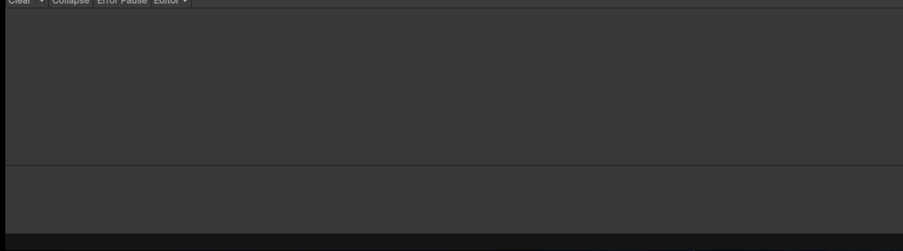

# M1GDV
Game Development Repo MA

# Coin, Goomba en Ghost 2.1

Script: [coin](Assets/coinpickup.cs)

# Stats 2.2

Script: [Stats](Assets/playerstats.cs)

# Collisions 3.1

# Fantasy opdracht 3.2C

Script: [Fantasy](Assets/Fantasy.cs)

# Coin pickup 4.2

Scripts [coinpickup](Assets/coinpickup.cs)

# Healthbar 5.1A

Script: [Healtbar](Assets/Scripts/healthbar.cs)

# WeaponSwitch 5.1B

Script: [WeaponSwitchEnum](Assets/Scripts/WeaponSwitch.cs)

# WeaponSwitchEnum 5.1C

Script: [WeaponSwitchEnum](Assets/Scripts/WeaponEnum.cs)

# Health Pickup 5.2

Script: [Healtpickup](Assets/Scripts/HealthPickup.cs)
[HealtVar](Assets/Scripts/PlayerVarHealth.cs)

# Game 6.1

Scripts: [Gamescripts](Assets/Scripts/PlayerVarHealth.cs)
[Healthpickup](Assets/Scripts/HealthPickup.cs)
